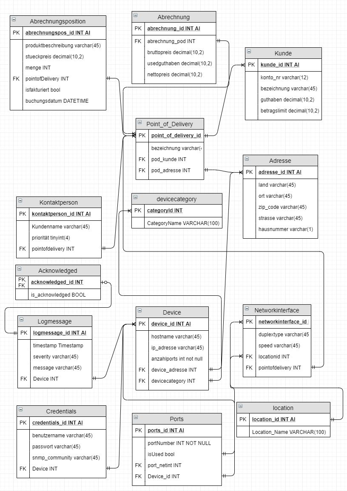

# DB-Testat-2

## Dokumentation Datenbank-Testat

### Ausgangslage
Die Firma Muster AG ist in den letzten Jahren vom kleinen Start-up zu einer respektablen Firma mit mehreren Standorten und Filialen gewachsen.
Die IT Abteilung der Muster AG ist aufgrund der Grösse der IT-Infrastruktur ebenfalls stark gewachsen.
Um die Kosten für den Unterhalt der IT-Abteilung für Muster AG zu verringern, wurde beschlossen, die Abteilung in eine eigene Muster IT-Services AG auszugliedern.
Diese soll als eigenständiges Tochterunternehmen IT-Dienstleistungen der Muster AG, aber auch für weitere Kunden, anbieten.

### Ziel
Aufgrund der strukturellen Veränderungen und der Grösse der IT-Infrastruktur von Muster AG beschloss die neu gegründete Muster IT-Services AG, ihr bisheriges Excel-basiertes Netzwerkmanagement durch eine professionelle Datenbanklösung zu ersetzen.

Die neue Datenbanklösung soll dabei im Wesentlichen drei Aspekte abdecken:
- **Planung & Dokumentation** des Netzwerks soll in der Datenbank erfolgen.
Aus den so erzeugten Daten sollen dann die Konfigurationsdaten für bestimmte Geräte generiert werden können, um so das Deployment zu vereinfachen.
Zudem soll durch die Datenbank auch die Kapazitätsplanung vereinfacht werden. 
- **Abrechnung** von Dienstleistungen gegenüber Kunden.
- **Troubleshooting** soll durch die systematische Erfassung von Netzwerkstrukturen sowie der Erfassung des Loggings beschleunigt werden.

### Anforderungen
Vom Kunden werden uns folgende Anforderungen gestellt.

Komponente | Anforderungen
--- | ---
Kunden | Ein Kunde verfügt über einen oder mehrere sogenannte „Point of Delivery/ies“ (PoD). Die Rechnungsadresse und die Kontaktperson können zwischen den PoDs variieren. PODs können mehrere Kontaktpersonen aufweisen, wobei diesen Prioritäten zugeordnet werden. 
Point of Delivery | Ein PoD reflektiert im Wesentlichen die Infrastruktur des Kunden. Ein PoD wird in mehrere Locations unterteilt. Ein PoD umfasst globale, für die Infrastruktur relevante, Informationen, wie beispielsweise einen oder mehrere NTP-Server oder die Zeitzone.
Location | Eine Location weist typischerweise eine Adresse auf und verfügt über eine Reihe von Geräten, die ihr zugeordnet werden. Ein Wunsch-Kriterium ist, dass eine Hierarchie von Locations angelegt werden kann.
Device | Ein Device (z.B. ein PC oder ein Switch) verfügt über ein oder mehrere Netzwerkinterfaces. Jedes Netzwerkinterface kann konfiguriert werden (Full/Half-Duplex, 1000/100/10 Mbit, etc.). Wie bei den Devices kann ein Netzwerkinterface entweder physisch oder virtuell (Loopback-Device, VLANInterface, …) vorhanden sein. Wird ein Netzwerkinterface benutzt wird es zwangsläufig mit einem anderen Interface verbunden.
Logging | Geräte sollen überwacht werden können. Zu diesem Zweck soll für jedes Gerät ein Log angelegt werden können, welches den Zeitpunkt, den Level (Severity) und die eigentliche LogNachricht speichern kann.
Credentials | Es soll möglich sein, Sets von Credentials (Benutzername, Passwort, SNMP Community) anzulegen und einem oder mehreren Geräten zuzuweisen. Dabei können Geräte mehrere Credentials haben. Credentials ihrerseits können in mehreren Geräten verwendet werden.
Abrechnungen & Zahlungen | Es sollen Abrechnungen für PoD’s erstellt werden können. Die Abrechnungen können diverse zu verrechnende Positionen enthalten. Diese reichen von Standard-Dienstleistungen nach (Stunden-)Aufwand, über einzelne Hard- und Software-Produkte bis hin zu Artikeln mit freiem Text und Preis. Die Positionen können, müssen aber nicht, einem Interface, einem Device oder einer Location zugeordnet werden. Für die Buchhaltung soll im System ein Kundenkonto geführt werden. Zahlungen können dabei ohne spezifischen Bezug zu einer Rechnung erfolgen.

### Konzept
Für die bestimmten Anforderungen haben wir ein Entity Relationship Model (ERM) vorbereitet, welches wir mit der Muster AG besprechen.

#### Annahmen
In der Beschreibung ist nicht genau beschrieben, ob es sich bei der Adresse um eine virtuelle (IP, MAC, etc) oder physische Adresse (Ort, PLZ, etc) handelt.
Anhand der Beschreibung nehmen wir an, dass es sich um eine physische Adresse handelt.

In der Beschreibung ist der Unterschied zwischen Device und Gerät nicht ersichtlich.
Anhand der Beschreibung gehen wir davon aus, dass es sich dabei um die selben Objekte handelt.

#### Beschreibung
**Kunde**: wir gehen davon aus, dass ein Kunde erst angelegt wird, wenn es dazu einen PointOfDelivery gibt.
Gemäss Beschreibung gibt es keinen Grund, weitere Informationen zum Kunden abzulegen, mit Ausnahme der Bezeichnung für Übersichtlichkeit.
Weitere Eigenschaften können zukünftig ergänzt werden.

**PointOfDelivery**: Für den PointOfDelivery wird der Kunde hinterlegt, um gleichnamige Objekte zu unterscheiden.

**Kontaktperson**: Aus der Beschreibung ist nicht zu entnehmen, dass die Kontaktperson über eine Adresse verfügt, oder zu einem Kunden gehört.
Wir haben diese Eigenschaften daher weggelassen.
Sie können falls nötig ergänzt werden.

**Abrechnung**: Eine Abrechnung gehört immer zu einem PointOfDelivery.
Die Abrechnung könnte sonst nicht abgerechnet werden.
Es kann optional für NetworkInterfaces, Devices oder eine Adresse separat eine Abrechnung hinterlegt werden.\
Eine Abrechnung verfügt über mehrere Positionen, aber immer mindestens eine.
Für die unterschiedlichen Positionstypen verwenden wir die Eigenschaft Produktbeschreibung, um die Details zu speichern und berechnen anhand des Stückpreis und der Menge den Totalpreis der Position.

**Adresse**: Wir haben die Location mit der Adresse zusammengefasst, weil sie eine 1:1 Verbindung haben und wir für die Location sonst keine Verwendung haben.

**NetworkInterface**: Da in der Beschreibung gesagt wird, dass ein NetworkInterface immer über ein verbundenes Interface verfügt, verwenden wir die Eigenschaft Next Interface um dies darzustellen.

**Device**: Ein Device verfügt optional über ein Parent Device, um die Hierarchie abzubilden.
Wenn kein Parent Device referenziert wird, bezeichnen wir es als Root-Device.\
Da ein Log pro Device geschrieben wird, halten wir mehrere LogMessages, die das Device referenzieren.

**Credentials**: Credentials werden mit einer Referenz auf das Device abgelegt, um Credential Sets abzubilden.

### Umsetzung
In diesem Kapitel beschreiben wir die Erstellung und Manipulation der Datenbank mithilfe der von uns erstellten DDL- und DML-Skripts.

[Erstellung (DDL)](./ddl.sql)

[Manipulation (DML)](./dml.sql)

[LogMessageAdd](./LogMessageAdd.sql)

Die Stored Procedure `LogMessageAdd` fügt neue Log-Einträge zum entsprechenden Device hinzu.

[v_logentries](./v_logentries.sql)

Mit der View `v_logentries` kann unser Monitoring-System die nicht-quittierten Logs anzeigen.
Für die View wurde ausserdem eine neue Tabelle `acknowledged` angelegt, welche den Status des Monitoring pro Logmessage überprüft.
Die View zeigt auch logmessages an, für die es in `acknowledged` keinen Eintrag gibt.

[Manuelle Fakturierung](./manuelleFakturierung.sql)

In dieser Stored Procedure wird die Abrechnung getätigt. Bei der Abrechnung wird das vorhandene Guthaben des Kunden berücksichtigt und falls vorhanden in der Abrechnung vermerkt. Die abgerechneten Abrechnungspositionen werden mit einem Flag isfaktueriert markiert. Die manuelle Fakturierung erfolgt mit dem Aufruf der Stored Procedure PodBill unter Beigabe der Id des Pod's. 

[Automatische Fakturierung](./AutomatischeFakturierung.sql)

Hier wird mittels eines Event automatisch eine Fakturierung ausgelöst, falls der Gesamtbetrag aller offenen Abrechnungspositionen das Betragslimit des Kunden überschreitet, oder die älteste Position älter als 3 Monate alt ist oder am 28. des Monats der Gesamtbetrag 1000.- Fr. übersteigt. Dies indem die Stored Procedure der manuellen Fakturierung aufgerufen wird.

## Arbeitsjournal
Wann | Was | Dauer [h]
--- | --- | ---
06.09.2019 | Modellierung der Datenbank-Struktur | 1.5
14.09.2019 | Definition DDL | 2
15.09.2019 | Definition DML | 2
15.09.2019 | Dokumentation | 1
24.01.2020 | Aufsetzen des GitHub-Repository | 1.5
<<<<<<< HEAD
30.01.2020 | LogMessageAdd hinzugefügt | 1
30.01.2020 | v_logentries hinzugefügt | 1.5
=======
30.01.2020 | Stored Procedure PodBill | 2
30.01.2020 | Automatische Fakturierung | 2
03.02.2020 | ERM angepasst | 1
03.02.2020 | Dokumentation Fakturierung | 1
03.02.2020 | DML angepasst | 1
